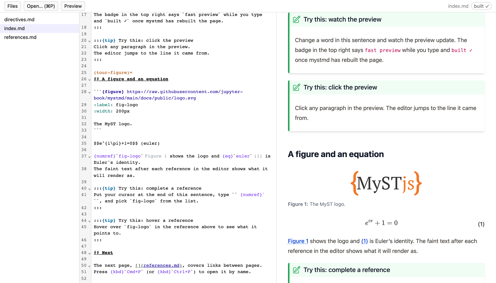

# MyST Author

[](https://codespaces.new/choldgraf/myst-author)
[](https://mybinder.org/v2/gh/choldgraf/myst-author/main?urlpath=myst-author/)

An editor for [MyST](https://mystmd.org) projects.
You edit Markdown on the left and see the rendered page on the right.
Cross-references are completed and checked as you type, across the whole project.



> [!NOTE]
> This is an early prototype.
> Expect rough edges, and please open an issue when you find one.

## Try it

Click one of the badges above to open the [tour project](docs/examples/tour/) in your browser.

To run it on your computer, you need Node 24 or newer.
[mystmd](https://mystmd.org/guide/installing) is recommended: without it you get no built preview and no references to other files.

```bash
git clone https://github.com/choldgraf/myst-author && cd myst-author
npm install
npm start -- docs/examples/tour     # or the path to your own MyST project
```

See [Get started](https://choldgraf.github.io/myst-author/get-started) for more options.

## Documentation

See [the documentation](https://choldgraf.github.io/myst-author/) to get started, take the guided tour, and learn how the pieces fit together.
