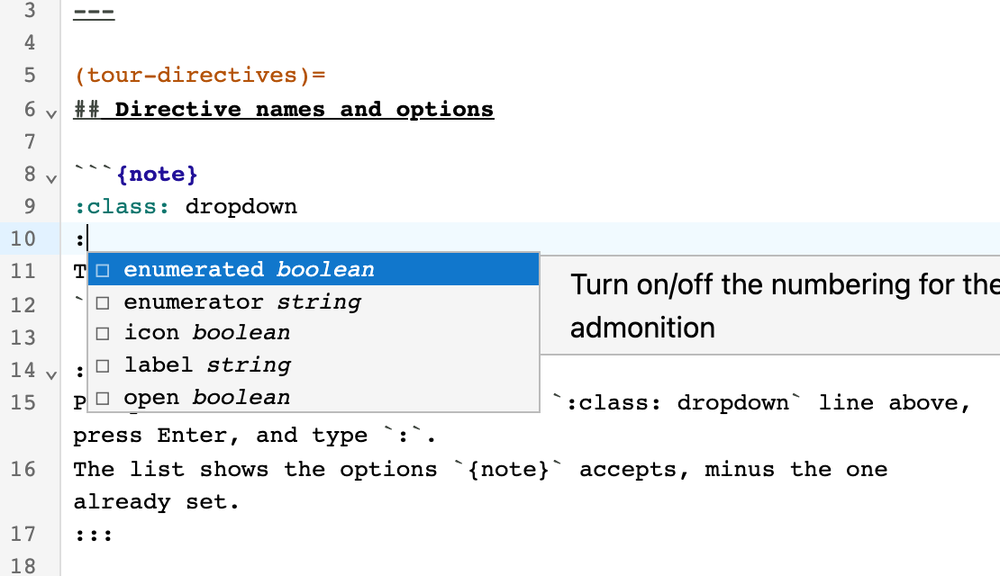

Typing ```` ```{ ````, `:::{` or `{` completes directive and role names, and `:` under a directive completes its options.
Hovering a name or option shows mystmd's description of it, and directive file arguments, such as a figure's image, complete and are checked.
This comes from [mystmd-lsp](https://chrisholdgraf.com/mystmd-lsp/features/), which uses mystmd's own directive and role specs.



## Syntax highlighting

The editor colours MyST syntax on top of normal Markdown highlighting.
This covers roles, directive names, directive options, labels like `(my-label)=`, inline math, and citations like `@smith2020`.

## Known limits

- Highlighting works one line at a time, so any line that looks like an option, such as `:width: 200px`, is coloured as one, even outside a directive.
- Plugin directives and roles from your `myst.yml` aren't in the completion lists, and the fast preview doesn't render them.
  The built preview does.
