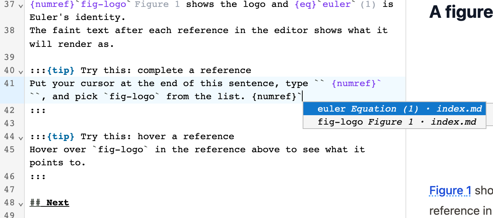
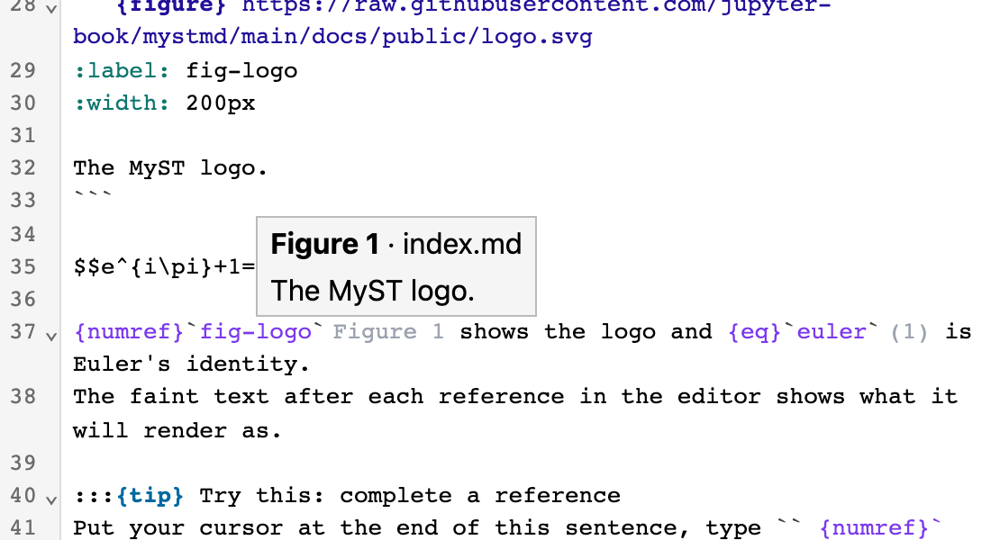
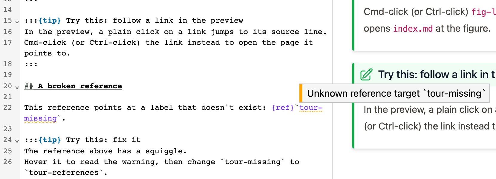
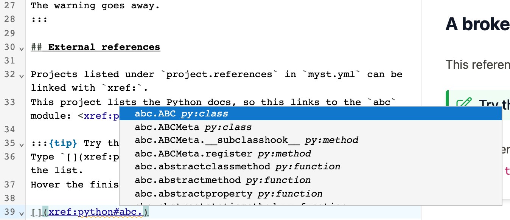

The editor helps you write cross-references: it completes them, shows what they point to, and warns about broken ones.
This help comes from MyST Author's language server, a separate program that indexes the labels in your project and answers the editor's questions about them.
The [VS Code extension](vscode.md) uses the same language server, so everything here works there too.

## Completion

Start typing a reference and a list of targets appears.
Each item shows the label, what it is (for example `Figure 1`), and the file it's in.
`` {numref}` `` only lists numbered things: figures, tables, code, and equations.
`` {eq}` `` only lists equations.



## Hints

A hint is faint text after a reference that shows what it will render as, such as `Figure 1` or `(1)`.

## Hover

Hover a reference to see what it points to and which file it's in.



## Go to definition

Cmd-click (or Ctrl-click) a reference, or put the cursor on it and press {kbd}`F12`.
If the target is in another file, that file opens at the target.
This works for `{doc}` references too.

## Find references and rename

Put the cursor on a reference or on a label's definition, such as `(my-label)=` or `:label: my-label`, and press {kbd}`Shift+F12` to list every reference to that label in the project.
Press {kbd}`F2` to rename the label and every reference to it at once.
Rename only works for labels you wrote yourself, and not for citations, external references, or labels in notebooks that aren't open.
In the web editor, rename only changes the file you have open; use VS Code to rename across files.

## Warnings

A reference to a label that doesn't exist gets a squiggle.
Hover it to read the warning.
A label that's defined more than once in your project gets a warning too.
Headings without an explicit label, like two `## Examples` headings in different files, don't.



Links to files, such as `{doc}` or `[](other.md)`, are not checked.
References inside code blocks and inline code aren't checked either, and get no hints or hover.
Completion still works there.

## External references

An external reference is a link into another MyST or Sphinx project, such as `[](xref:python#abc.ABC)`.
List those projects under `project.references` in your `myst.yml`:

```yaml
project:
  references:
    python: https://docs.python.org/3/
```

You then get completion of project keys, pages, and targets, and a hover with the resolved URL.
A link without text gets a hint with the remote title, which is what it will render as.
Each project's index is downloaded when you open the editor in your browser, or when the VS Code extension starts.
If the download fails, for example when you're offline, external references aren't checked.



## Citations

Type `@` or `` {cite}` `` to complete citation keys from your project's `.bib` files.
Each item shows the author, year, and title, and you can search by title.
Hover a citation to see its entry, or go to definition to open it in the `.bib` file.
`@name` also completes and resolves labels: like mystmd, it's a citation if your bibliography has `name`, and a cross-reference otherwise.

The bibliography is `project.bibliography` in your `myst.yml`, or every `.bib` file in the project if that isn't set.
It's read when the language server starts, so restart the editor after editing a `.bib` file.
Unknown citation keys are only flagged when all of your bibliography files are local.

## Where targets come from

The editor runs `myst start --headless` on your project, and the language server reads the pages mystmd builds.
It also re-parses the file you're editing as you type, so a label you just added can be used straight away.
Warnings about unknown labels start once mystmd's first build has loaded.

Without mystmd, the language server only knows the open file.
You still get completion, hints, and hover for labels in that file, but not for labels in other files.
It doesn't warn about unknown labels, because they might be defined in a file it can't see.

## Not supported

- Suggestions for new labels.

Developers can find the full list of language server features in the [`@myst-author/lsp` README](https://github.com/choldgraf/myst-author/tree/main/packages/lsp).
